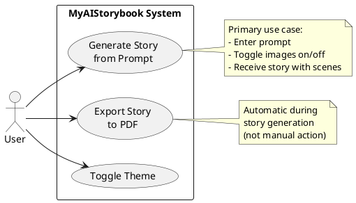
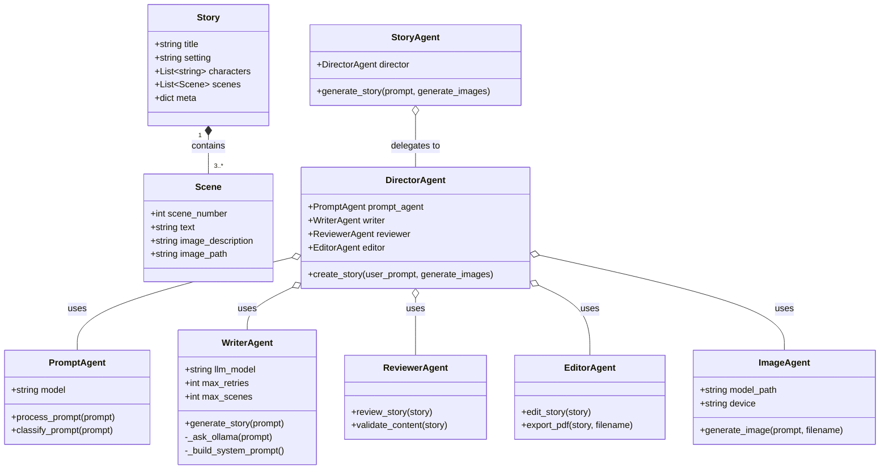
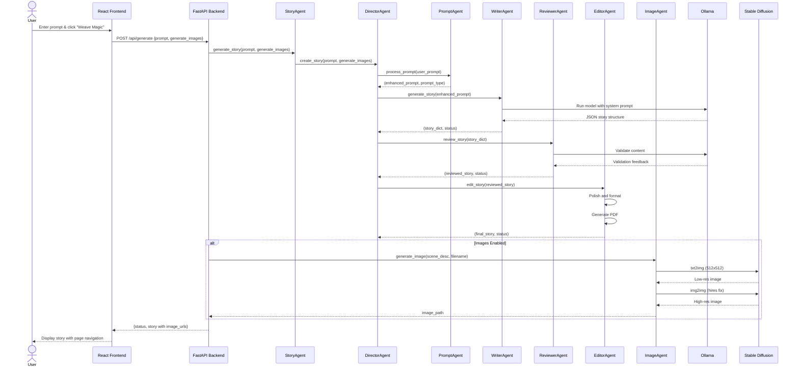
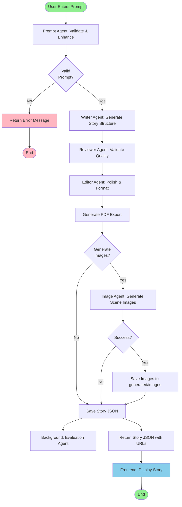
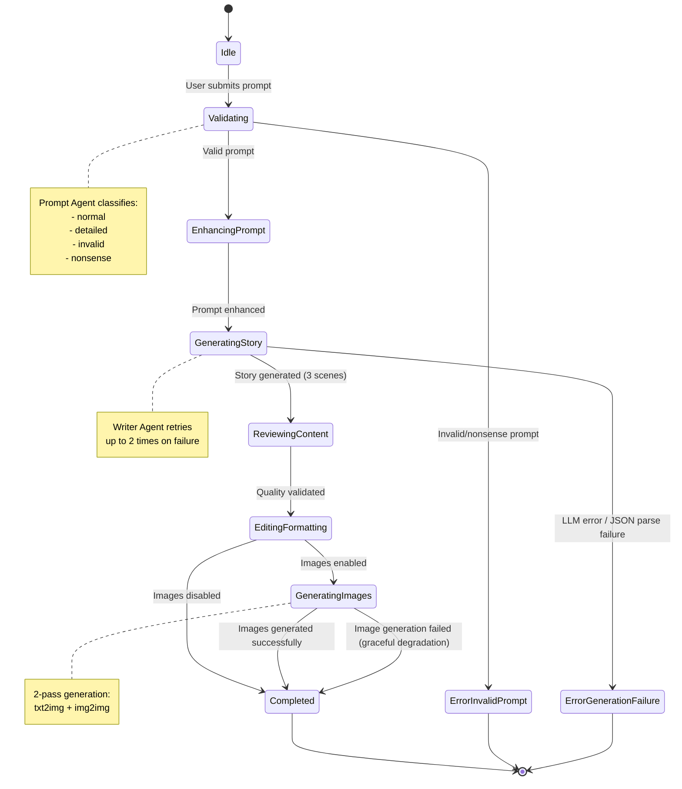
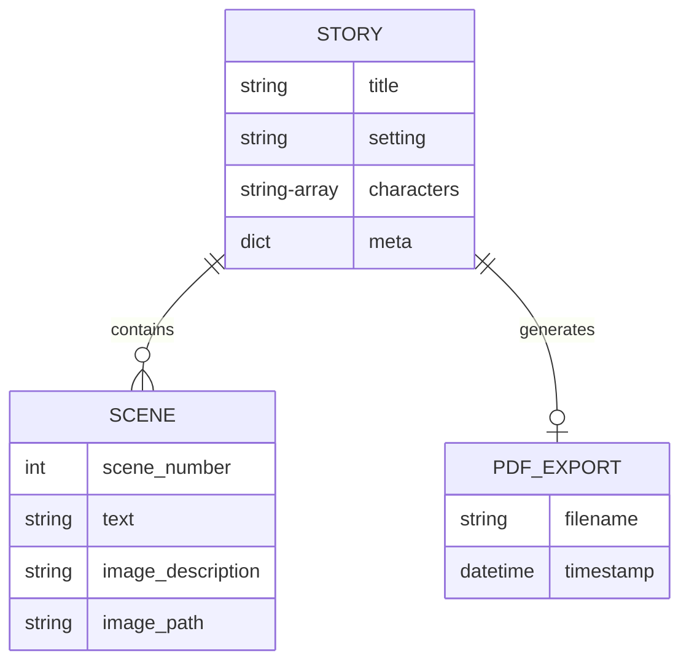

# MyAIStorybook - Diagrams Guide for FYP Documentation

This guide provides details for all diagrams needed in the FYP documentation, with Mermaid code templates and alternative tool recommendations.

## 📊 Overview

**Total Diagrams Needed:** 8
- **High Priority:** 3 diagrams (Use Case, Class, Architecture)
- **Medium Priority:** 3 diagrams (Sequence, Activity, State)
- **Lower Priority:** 2 diagrams (DFD, Domain Model)

---

## Tool Recommendations

### Best Tools by Diagram Type

| Diagram Type | Best Tool | Alternative | Mermaid Support |
|--------------|-----------|-------------|-----------------|
| Use Case | **Draw.io** or PlantUML | Lucidchart | ❌ Poor |
| Class Diagram | **Mermaid** or PlantUML | Draw.io | ✅ Excellent |
| Sequence | **Mermaid** | PlantUML | ✅ Excellent |
| State | **Mermaid** | PlantUML | ✅ Excellent |
| Activity | **Draw.io** or PlantUML | Mermaid Flowchart | ⚠️ Limited |
| Data Flow | **Draw.io** | Lucidchart | ❌ No Support |
| Architecture | **Mermaid** (already have) | Draw.io | ✅ Good |
| Domain Model | **Mermaid** (same as Class) | Draw.io | ✅ Good |

### Tool Links
- **Mermaid Live Editor**: https://mermaid.live/ (online, instant preview)
- **Draw.io**: https://app.diagrams.net/ (free, online/desktop)
- **PlantUML**: https://plantuml.com/ (online editor available)
- **Visual Paradigm Online**: https://online.visual-paradigm.com/ (free tier, good for UML)

---

## 🎯 Priority 1: Essential Diagrams (Do These First)

### 1. Use Case Diagram (Chapter 2, Section 2.1)

**Location in Doc:** Chapter 2, after "Use Case Analysis" heading  
**Shows:** The 3 main use cases with actors and system boundary  
**Best Tool:** Draw.io or PlantUML (Mermaid doesn't support use case diagrams well)

#### What to Include:
- **Actors:** User (Parent/Educator/Child)
- **Use Cases:** 
  - UC1: Generate Story from Prompt
  - UC2: Export Story to PDF (automatic)
  - UC3: Toggle Theme
- **System Boundary:** MyAIStorybook System
- **Relationships:** Association lines from actors to use cases

#### PlantUML Code Example:


#### Draw.io Instructions:
1. Go to https://app.diagrams.net/
2. Create new diagram → UML → Use Case
3. Add actor (stick figure) labeled "User"
4. Add rectangle for system boundary labeled "MyAIStorybook System"
5. Add 3 ovals inside for use cases
6. Draw lines from actor to use cases
7. Export as PNG or PDF at 300 DPI

**Estimated Time:** 30 minutes

---

### 2. Class Diagram (Chapter 3, Section 3.3.3)

**Location in Doc:** Chapter 3, "Class Diagram: Core Domain Model"  
**Shows:** Story, Scene, all Agent classes with relationships  
**Best Tool:** Mermaid (excellent support)

#### What to Include:
- **Story Class:** title, setting, characters, scenes, meta
- **Scene Class:** scene_number, text, image_description, image_path
- **Agent Hierarchy:** Base concept with specialized agents
- **Relationships:** Composition (Story has Scenes), Agent specializations

#### Mermaid Code:


**Save As:** `diagrams/class_diagram.mmd`  
**Export:** Use Mermaid Live Editor to export as PNG/SVG  
**Estimated Time:** 45 minutes

---

### 3. Architecture Diagram (Chapter 3, Section 3.2.2)

**Location in Doc:** Chapter 3, "Architecture Diagram"  
**Status:** ✅ Already exists at `diagrams/architecture_diagram/architecture_diagram.mmd`  
**Action Needed:** Convert to PNG/SVG for LaTeX

#### Steps to Export:
1. Open https://mermaid.live/
2. Copy content from `architecture_diagram.mmd`
3. Paste into editor
4. Click "Export" → PNG or SVG
5. Choose high resolution (at least 1920px width)
6. Save as `architecture_diagram.png` in `document/FYP1/ThesisFigs/`

**Estimated Time:** 10 minutes (just export)

---

## 🎯 Priority 2: Important Diagrams (Do These Second)

### 4. Sequence Diagram (Chapter 3, Section 3.3.2)

**Location in Doc:** Chapter 3, "Sequence Diagram: Multi-Agent Story Generation"  
**Shows:** Message flow between frontend, API, agents, and AI models  
**Best Tool:** Mermaid (excellent support)

#### What to Include:
- **Actors/Components:** User, Frontend, API (main.py), StoryAgent, DirectorAgent, PromptAgent, WriterAgent, ReviewerAgent, EditorAgent, ImageAgent, Ollama, Stable Diffusion
- **Flow:** Complete request from user click to story display

#### Mermaid Code:


**Save As:** `diagrams/sequence_diagram.mmd`  
**Estimated Time:** 1 hour

---

### 5. Activity Diagram (Chapter 3, Section 3.3.1)

**Location in Doc:** Chapter 3, "Activity Diagram: Story Generation Workflow"  
**Shows:** Complete workflow from prompt to display  
**Best Tool:** Draw.io (Mermaid flowcharts work but limited)

#### What to Include:
- **Start:** User enters prompt
- **Decision Points:** 
  - Valid prompt? (Yes/No)
  - Generate images? (Yes/No)
  - Image generation success? (Yes/No)
- **Processes:** Validate, Enhance, Write, Review, Edit, Generate Images, Save, Display
- **End:** Story displayed to user

#### Draw.io Instructions:
1. Use "Flowchart" template
2. Start with rounded rectangle "User Enters Prompt"
3. Add diamond for "Valid Prompt?"
4. Add process boxes for each agent
5. Add parallel paths for image generation
6. End with "Display Story"
7. Use colors: Green for success paths, Red for error paths

**Alternative - Mermaid Flowchart:**


**Save As:** `diagrams/activity_diagram.mmd` (or create in Draw.io)  
**Estimated Time:** 1.5 hours

---

### 6. State Transition Diagram (Chapter 3, Section 3.3.4)

**Location in Doc:** Chapter 3, "State Transition Diagram: Story Generation States"  
**Shows:** Lifecycle of a story generation request  
**Best Tool:** Mermaid (excellent support)

#### What to Include:
- **States:** Idle, Validating, Generating, Reviewing, Editing, Generating Images, Completed, Error
- **Transitions:** Events that trigger state changes
- **Error States:** Invalid Prompt, Generation Failure, Image Failure

#### Mermaid Code:


**Save As:** `diagrams/state_diagram.mmd`  
**Estimated Time:** 45 minutes

---

## 🎯 Priority 3: Supplementary Diagrams (Do If Time Permits)

### 7. Data Flow Diagram (Chapter 3, Section 3.3.5)

**Location in Doc:** Chapter 3, "Data Flow Diagram: System-Level Processing"  
**Shows:** Data movement through system with data stores  
**Best Tool:** Draw.io (Mermaid doesn't support DFD)

#### What to Include:

**Level 0 DFD (Context):**
- External Entity: User
- Single Process: MyAIStorybook System
- Data Flows: Prompt In, Story + Images Out

**Level 1 DFD (Decomposed):**
- **Processes:**
  - 1.0 Validate & Enhance Input
  - 2.0 Generate Story Narrative
  - 3.0 Generate Scene Illustrations
  - 4.0 Review & Validate Quality
  - 5.0 Edit & Format Output
  - 6.0 Evaluate Story Metrics
- **Data Stores:**
  - D1: Prompts
  - D2: Drafts
  - D3: Images
  - D4: Reviews
  - D5: Edits
  - D6: Stories
  - D7: Exports
  - D8: Evaluations
- **Data Flows:** Connect processes showing data movement

#### Draw.io Instructions:
1. Use "Data Flow Diagram" template or create custom
2. Use circles for processes, rectangles for external entities
3. Use parallel lines for data stores
4. Use arrows for data flows (label each)
5. Create two diagrams: Level 0 and Level 1
6. Use consistent notation (Gane-Sarson or Yourdon)

**Estimated Time:** 2 hours (both levels)

---

### 8. Domain Model / ER Diagram (Chapter 2, Section 2.4)

**Location in Doc:** Chapter 2, "Domain Model"  
**Shows:** Core entities and relationships (can reuse Class Diagram with simplification)  
**Best Tool:** Mermaid or reuse Class Diagram

#### What to Include:
- Simplified version of Class Diagram focusing on data entities
- Story, Scene, Character (if modeled separately)
- Relationships and cardinalities

#### Option 1: Reuse Class Diagram
Simply use the same Class Diagram from Priority 1 #2 or create a simplified version.

#### Option 2: Mermaid ER Diagram


**Save As:** `diagrams/domain_model.mmd`  
**Estimated Time:** 30 minutes (or 5 minutes if reusing Class Diagram)

---

## 📋 Checklist & Timeline

### Week 1 (High Priority)
- [ ] **Day 1-2:** Use Case Diagram (Draw.io/PlantUML) - 30 min
- [ ] **Day 2-3:** Class Diagram (Mermaid) - 45 min  
- [ ] **Day 3:** Export Architecture Diagram (already exists) - 10 min

### Week 2 (Medium Priority)
- [ ] **Day 1-2:** Sequence Diagram (Mermaid) - 1 hour
- [ ] **Day 3-4:** Activity Diagram (Draw.io or Mermaid) - 1.5 hours
- [ ] **Day 4-5:** State Diagram (Mermaid) - 45 min

### Week 3 (If Time Permits)
- [ ] **Day 1-2:** Data Flow Diagram Level 0 & 1 (Draw.io) - 2 hours
- [ ] **Day 3:** Domain Model (reuse Class or create ER) - 30 min

---

## 🛠️ Workflow Recommendations

### For Mermaid Diagrams:
1. Write code in VS Code with Mermaid extension (instant preview)
2. Or use https://mermaid.live/ for online editing
3. Save `.mmd` files in `diagrams/` directory
4. Export as PNG (2000px width minimum) or SVG
5. Save exports in `document/FYP1/ThesisFigs/`

### For Draw.io Diagrams:
1. Use https://app.diagrams.net/
2. Save source `.drawio` files in `diagrams/` directory (for future edits)
3. Export as PNG at 300 DPI or as PDF
4. Save exports in `document/FYP1/ThesisFigs/`

### Inserting in LaTeX:
```latex
\begin{figure}[h]
\centering
\includegraphics[width=0.9\textwidth]{ThesisFigs/class_diagram.png}
\caption{Class Diagram showing Story, Scene, and Agent hierarchy}
\label{fig:class-diagram}
\end{figure}
```

---

## 🎨 Style Guidelines

### Consistency:
- **Colors:** Use consistent color scheme across all diagrams
  - Success/Positive: Green (#90EE90)
  - Error/Negative: Red/Pink (#FFB6C1)
  - Process/Neutral: Blue (#87CEEB)
  - Data: Yellow (#FFFACD)

### Fonts:
- Use readable sans-serif fonts (Arial, Helvetica)
- Minimum 12pt font size
- Bold for entity/class names

### Layout:
- Left-to-right flow when possible
- Top-to-bottom for hierarchies
- Clear spacing between elements
- Align elements on grid

---

## 🚀 Quick Start

**Want to start immediately?**

1. **Install Mermaid CLI** (optional, for local generation):
   ```bash
   npm install -g @mermaid-js/mermaid-cli
   ```

2. **Generate from `.mmd` files**:
   ```bash
   mmdc -i diagrams/class_diagram.mmd -o document/FYP1/ThesisFigs/class_diagram.png -w 2000
   ```

3. **Or use online**: https://mermaid.live/ (easiest for beginners)

---

## 📞 Need Help?

- **Mermaid Docs**: https://mermaid.js.org/
- **PlantUML Docs**: https://plantuml.com/
- **Draw.io Tutorials**: https://www.diagrams.net/doc/
- **UML Guide**: https://www.visual-paradigm.com/guide/uml-unified-modeling-language/

---

**Good luck with your diagrams! Start with Priority 1, they're the most important for your FYP evaluation.** 🎓

