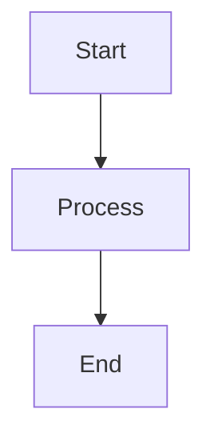
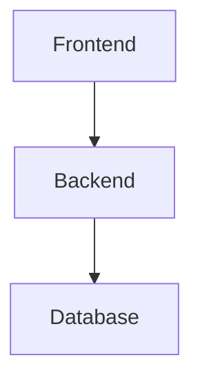

# Mermaid Diagrams - MyAIStorybook

This folder contains all system diagrams in **Mermaid** format (.mmd files). These are the same diagrams as the PlantUML versions but in Mermaid syntax for better GitHub/GitLab integration and web rendering.

## 📊 Diagram Files

1. **01_use_case_diagram.mmd** - Use Case Diagram
2. **02_domain_model.mmd** - Domain Model (Class Diagram)
3. **03_sequence_story_generation.mmd** - Sequence: Story Generation
4. **04_sequence_character_chat.mmd** - Sequence: Character Chat
5. **05_sequence_idea_workshop.mmd** - Sequence: Idea Workshop
6. **06_activity_diagram.mmd** - Activity Diagram
7. **07_state_diagram.mmd** - State Diagram
8. **08_dfd_context.mmd** - DFD Context (Level 0)
9. **09_dfd_level1.mmd** - DFD Level 1
10. **10_dfd_level2_story_generation.mmd** - DFD Level 2: Story Generation
11. **11_class_diagram.mmd** - Class Diagram
12. **12_component_diagram.mmd** - Component Diagram
13. **13_deployment_diagram.mmd** - Deployment Diagram
14. **14_system_sequence_diagram.mmd** - System Sequence Diagram

## 🔧 How to View Mermaid Diagrams

### Option 1: GitHub/GitLab (Automatic Rendering)
Simply view the `.mmd` files on GitHub or GitLab - they render automatically!

### Option 2: Mermaid Live Editor (Online)
1. Go to https://mermaid.live/
2. Copy the content of any `.mmd` file
3. Paste into the editor
4. View and export as PNG/SVG

### Option 3: VS Code Extension
1. Install "Markdown Preview Mermaid Support" extension
2. Create a markdown file with:
   ````markdown
   ```mermaid
   [paste mermaid code here]
   ```
   ````
3. Preview the markdown file

### Option 4: Mermaid CLI
```bash
# Install Mermaid CLI
npm install -g @mermaid-js/mermaid-cli

# Generate PNG
mmdc -i diagram.mmd -o diagram.png

# Generate SVG
mmdc -i diagram.mmd -o diagram.svg

# Generate PDF
mmdc -i diagram.mmd -o diagram.pdf
```

## 📝 Embedding in Markdown

You can embed these diagrams directly in markdown files:

````markdown

````

## 🎨 Mermaid vs PlantUML

| Feature | Mermaid | PlantUML |
|---------|---------|----------|
| **GitHub Rendering** | ✅ Native | ❌ Requires plugin |
| **GitLab Rendering** | ✅ Native | ❌ Requires plugin |
| **Markdown Integration** | ✅ Excellent | ⚠️ Limited |
| **Syntax** | Simple | More verbose |
| **Diagram Types** | Good coverage | Excellent coverage |
| **Customization** | Limited | Extensive |
| **Learning Curve** | Easy | Moderate |

## 💡 Best Use Cases

**Use Mermaid for:**
- Documentation in GitHub/GitLab repositories
- README files
- Wiki pages
- Quick diagrams
- Web-based documentation

**Use PlantUML for:**
- Detailed UML diagrams
- Academic documentation
- Print-quality exports
- Complex diagrams with extensive customization

## 🔄 Conversion Notes

These Mermaid diagrams are **semantically equivalent** to the PlantUML versions. Some notes:

1. **Use Case Diagrams**: Represented as flowcharts (Mermaid doesn't have native use case support)
2. **DFD Diagrams**: Represented as flowcharts with styled nodes
3. **Component/Deployment**: Represented as flowcharts with subgraphs
4. **All other diagrams**: Native Mermaid diagram types used

## 📚 Mermaid Documentation

- **Official Docs**: https://mermaid.js.org/
- **Live Editor**: https://mermaid.live/
- **Syntax Guide**: https://mermaid.js.org/intro/syntax-reference.html
- **Examples**: https://mermaid.js.org/ecosystem/integrations.html

## 🎯 Quick Examples

### Viewing in GitHub
Just push these files to GitHub and view them directly - they'll render automatically!

### Viewing Locally
```bash
# Install Mermaid CLI
npm install -g @mermaid-js/mermaid-cli

# Generate all diagrams as PNG
for file in *.mmd; do mmdc -i "$file" -o "${file%.mmd}.png"; done
```

### Embedding in Documentation
Create a `docs/diagrams.md` file:

````markdown
# System Diagrams

## Use Case Diagram
```mermaid
[paste content from 01_use_case_diagram.mmd]
```

## Domain Model
```mermaid
[paste content from 02_domain_model.mmd]
```
````

## ✅ Advantages of Mermaid Format

1. **Version Control Friendly**: Text-based, easy to diff
2. **GitHub/GitLab Native**: Renders automatically
3. **Markdown Integration**: Embed directly in docs
4. **No External Tools**: View in browser
5. **Lightweight**: No Java or Graphviz required
6. **Collaborative**: Easy to edit and review

## 📊 Supported Diagram Types

- ✅ Flowchart / Graph
- ✅ Sequence Diagram
- ✅ Class Diagram
- ✅ State Diagram
- ✅ Entity Relationship Diagram
- ✅ User Journey
- ✅ Gantt Chart
- ✅ Pie Chart
- ✅ Git Graph

## 🔗 Integration Examples

### In README.md
````markdown
## System Architecture


````

### In GitHub Issues
Just paste the mermaid code block - it renders automatically!

### In Pull Requests
Add diagrams to PR descriptions for better context.

---

**Format**: Mermaid (.mmd)  
**Total Diagrams**: 14  
**Created**: December 5, 2025  
**Compatible With**: GitHub, GitLab, VS Code, Markdown

For PlantUML versions, see the parent `diagrams/` folder.
