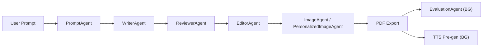
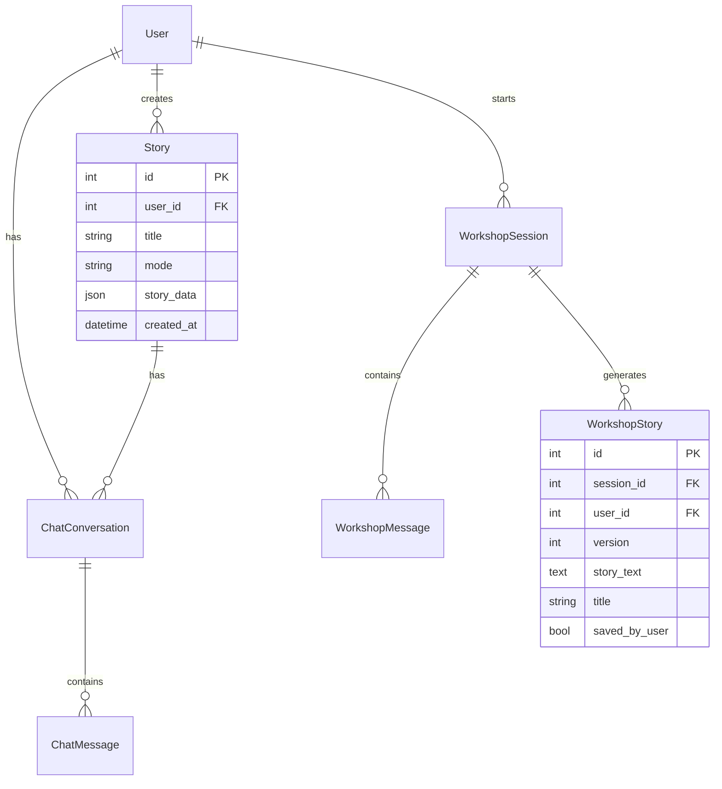

# 📖 MyAIStorybook — Complete Codebase Analysis

**Project**: AI-powered children's storybook generator with personalized illustrations  
**Institution**: FAST NUCES Islamabad | FYP 2022–2026  
**Team**: Muhammad Abdul Wahab Kiyani (22I-1178), Syed Ahmed Ali Zaidi (22I-1237), Mujahid Abbas (22I-1969)  
**Iteration**: 3 of 4 (Advanced Features & Personalization)

---

## 1. High-Level Project Summary

MyAIStorybook is a **fully local/offline** AI application that generates illustrated, personalized children's storybooks. A child (or parent) provides a story idea (text or voice), and the system:

1. **Validates & enhances** the prompt via an LLM
2. **Generates a multi-scene story** (3–6 pages) with a structured beginning → climax → ending
3. **Generates illustrations** for each scene using Stable Diffusion 1.5
4. Optionally **personalizes images** by embedding the user's face using IP-Adapter FaceID
5. **Exports** the final product as a styled PDF storybook
6. Offers an **interactive chatbot** that impersonates story characters
7. Provides an **Idea Workshop** for AI-assisted story brainstorming
8. Runs **background evaluation** of story quality (readability, coherence, image-text alignment)
9. Supports **Text-to-Speech** (Piper TTS) and **Speech-to-Text** (Whisper STT)

All AI processing runs **locally on the user's machine** — no cloud APIs.

---

## 2. Tech Stack

| Layer | Technology | Details |
|-------|-----------|---------|
| **Backend** | Python 3.10+ / FastAPI | REST API on port 8000 |
| **Frontend** | Next.js 14 (App Router) / React 18 / TypeScript | SPA on port 3000 |
| **Database** | PostgreSQL + SQLAlchemy ORM | User data, stories, chat, workshop sessions |
| **LLM** | Ollama (Llama 3.1 8B / Mistral-Nemo 12B) | Local inference, subprocess calls |
| **Image Gen** | Stable Diffusion 1.5 (DreamShaper 8) | Via `diffusers` library + WebUI API |
| **Personalization** | IP-Adapter FaceID Plus v2 + ControlNet | Via Stable Diffusion WebUI API (port 7860/7861) |
| **TTS** | Piper TTS (ONNX models) | Local offline, male/female voices |
| **STT** | OpenAI Whisper (base model) | Local offline, WAV input |
| **Evaluation** | CLIP (image-text) + Sentence Transformers + InsightFace + textstat | Quality metrics |
| **Auth** | JWT (python-jose) + bcrypt (passlib) | 7-day token expiry |
| **GPU Mgmt** | PyTorch CUDA + psutil | Ollama pause/resume for VRAM sharing |

### Key Libraries
- `langchain`, `langgraph` — Workshop agent conversation management
- `reportlab` — PDF generation with styled layouts
- `pillow`, `opencv-python` — Image processing
- `pydantic` — Story schema validation
- `sentence-transformers`, `scikit-learn` — Text coherence evaluation

---

## 3. Folder Structure & Roles

```
MyAIStorybook - Mujahid/
├── backend/                          ← FastAPI backend (Python)
│   ├── main.py                       ← API entrypoint — ALL routes defined here (~1174 lines)
│   ├── main_pipeline.py              ← Legacy/test pipeline script
│   ├── agents/                       ← AI agent modules
│   │   ├── director_agent.py         ← Orchestrator: Prompt → Writer → Reviewer → Editor
│   │   ├── prompt_agent.py           ← Input classification & enhancement via Ollama
│   │   ├── writer_agent.py           ← Story JSON generation via Ollama
│   │   ├── reviewer_agent.py         ← Schema validation + quality metrics
│   │   ├── editor_agent.py           ← Metadata finalization + PDF export
│   │   ├── story_agent.py            ← Facade over DirectorAgent (backward compat)
│   │   ├── image_agent.py            ← Standard SD image gen (txt2img + img2img hires fix)
│   │   ├── personalized_image_agent_webui_api.py  ← WebUI API + IP-Adapter FaceID
│   │   ├── chatbot_agent.py          ← ReAct-based character impersonation
│   │   ├── idea_workshop_agent.py    ← Original workshop agent (~37K, large file)
│   │   ├── idea_workshop_agent_langchain.py  ← LangChain-based workshop agent (~29K)
│   │   ├── evaluation_agent.py       ← Background evaluation subprocess entry point
│   │   └── test_*.py                 ← Inline test scripts for agents
│   ├── auth/                         ← Authentication system
│   │   ├── database.py               ← PostgreSQL engine + session factory
│   │   ├── models.py                 ← User SQLAlchemy model
│   │   ├── db_models.py              ← Story, Chat, Workshop SQLAlchemy models
│   │   ├── schemas.py                ← Pydantic request/response schemas
│   │   ├── routes.py                 ← /api/auth/* endpoints (register, login, me)
│   │   ├── security.py               ← JWT + bcrypt utilities
│   │   └── dependencies.py           ← FastAPI auth dependencies
│   ├── models/
│   │   └── story_schema.py           ← Pydantic Story/Scene validation models
│   ├── utils/
│   │   ├── content_safety.py         ← Blocked/warning keyword filter + safe prompts
│   │   ├── ollama_manager.py         ← Pause/resume Ollama for GPU memory
│   │   ├── tts_manager.py            ← Piper TTS audio generation
│   │   ├── stt_manager.py            ← Whisper STT transcription
│   │   ├── evaluation_manager.py     ← CLIP + SentenceTransformer + textstat evaluation
│   │   └── ip_adapter_downloader.py  ← Model download utility
│   ├── tests/
│   │   ├── whitebox/                 ← 47 unit tests (86% coverage)
│   │   ├── blackbox/                 ← 68 manual test cases
│   │   └── conftest.py               ← Test fixtures
│   ├── pretrained/                   ← AI model weights directory (gitignored)
│   └── venv/                         ← Python virtual environment
│
├── frontend/                         ← Next.js 14 frontend (TypeScript)
│   ├── src/
│   │   ├── app/
│   │   │   ├── layout.tsx            ← Root layout (ThemeProvider + AuthProvider)
│   │   │   └── page.tsx              ← Main SPA page — all state & routing logic
│   │   ├── pages/
│   │   │   ├── Auth/                 ← Login.tsx, Register.tsx
│   │   │   ├── Home/                 ← LandingPage, ModeSelection, IdeaWorkshop, WorkshopPage
│   │   │   └── Story/               ← StoryInput, StoryDisplay, Chatbot
│   │   ├── layout/                   ← Persistent layout components
│   │   │   └── components/           ← Navigation, Footer, StoryHistorySidebar, WorkshopLibrarySidebar
│   │   ├── contexts/                 ← React contexts
│   │   │   ├── AuthContext.tsx        ← JWT auth state (login, register, logout)
│   │   │   └── ThemeContext.tsx        ← Light/Dark theme (CSS custom properties)
│   │   ├── hooks/                    ← Custom React hooks
│   │   │   ├── useLoadingMessages.ts  ← Rotating loading messages
│   │   │   └── useSpeechToText.ts     ← STT recording + API integration
│   │   ├── shared/components/        ← Reusable components
│   │   │   ├── LoadingExperience.*    ← Full-screen loading overlay
│   │   │   ├── ThemeToggle.*          ← Dark/Light mode switch
│   │   │   ├── VoiceInputButton.*     ← Speech-to-text microphone button
│   │   │   └── ContactSection.*       ← Contact form section
│   │   ├── styles/globals.css        ← Global stylesheet
│   │   ├── types/theme.ts           ← TypeScript theme type definitions
│   │   └── utils/constants.ts        ← API base URL and constants
│   └── package.json                  ← React 18, Next.js 14, TypeScript 5
│
├── generated/                        ← Runtime output (gitignored content)
│   ├── images/                       ← Scene illustration PNGs
│   ├── stories/                      ← Story JSON files
│   ├── exports/                      ← PDF storybooks
│   ├── audio/                        ← TTS WAV files
│   └── evaluations/                  ← Quality evaluation JSONs
│
├── document/                         ← FYP academic documentation
│   ├── Scope document.txt            ← Original project proposal
│   └── FYP1-Mid Report/              ← LaTeX mid-term report
│
├── diagram_documentation/            ← Architecture diagram descriptions
├── diagram_images/                   ← Diagram image files
├── diagrams/                         ← Mermaid/diagram source files
├── standee/                          ← FYP presentation standee
│
├── start_all.bat                     ← Launch script: WebUI → Backend → Frontend
├── requirements.txt                  ← Top-level Python dependencies
├── CURRENT_ITERATION_STATUS.md       ← Project tracking document
└── README.md                         ← Project documentation
```

---

## 4. Key Components & Responsibilities

### 4.1 Backend Agents (Multi-Agent Pipeline)



| Agent | File | Responsibility |
|-------|------|----------------|
| **PromptAgent** | [prompt_agent.py](file:///c:/Users/wahab/Downloads/FYP/storybook-fyp/MyAIStorybook%20-%20Mujahid/backend/agents/prompt_agent.py) | Classifies prompt type (short/normal/long/invalid/nonsense) and enhances it via Ollama with few-shot examples |
| **DirectorAgent** | [director_agent.py](file:///c:/Users/wahab/Downloads/FYP/storybook-fyp/MyAIStorybook%20-%20Mujahid/backend/agents/director_agent.py) | Orchestrates the full pipeline: Prompt → Writer → Reviewer → Editor |
| **WriterAgent** | [writer_agent.py](file:///c:/Users/wahab/Downloads/FYP/storybook-fyp/MyAIStorybook%20-%20Mujahid/backend/agents/writer_agent.py) | Generates structured story JSON with scenes via Ollama. Validates with Pydantic |
| **ReviewerAgent** | [reviewer_agent.py](file:///c:/Users/wahab/Downloads/FYP/storybook-fyp/MyAIStorybook%20-%20Mujahid/backend/agents/reviewer_agent.py) | Schema validation + per-scene metrics (word count, length score, image coverage) |
| **EditorAgent** | [editor_agent.py](file:///c:/Users/wahab/Downloads/FYP/storybook-fyp/MyAIStorybook%20-%20Mujahid/backend/agents/editor_agent.py) | Adds metadata + exports styled PDF with parchment backgrounds, borders, and Comic Sans font |
| **StoryAgent** | [story_agent.py](file:///c:/Users/wahab/Downloads/FYP/storybook-fyp/MyAIStorybook%20-%20Mujahid/backend/agents/story_agent.py) | Facade over DirectorAgent for backward compatibility |
| **ImageAgent** | [image_agent.py](file:///c:/Users/wahab/Downloads/FYP/storybook-fyp/MyAIStorybook%20-%20Mujahid/backend/agents/image_agent.py) | Standard SD 1.5 image gen: txt2img (512×512) → img2img hires fix. Content safety filtered |
| **PersonalizedImageAgent** | [personalized_image_agent_webui_api.py](file:///c:/Users/wahab/Downloads/FYP/storybook-fyp/MyAIStorybook%20-%20Mujahid/backend/agents/personalized_image_agent_webui_api.py) | WebUI API integration with IP-Adapter FaceID Plus v2 + ControlNet for facial likeness |
| **ChatbotAgent** | [chatbot_agent.py](file:///c:/Users/wahab/Downloads/FYP/storybook-fyp/MyAIStorybook%20-%20Mujahid/backend/agents/chatbot_agent.py) | ReAct-based character impersonation. Strategies: in_character_answer, story_redirect, gentle_decline |
| **IdeaWorkshopAgent** | [idea_workshop_agent_langchain.py](file:///c:/Users/wahab/Downloads/FYP/storybook-fyp/MyAIStorybook%20-%20Mujahid/backend/agents/idea_workshop_agent_langchain.py) | LangChain-based conversational story ideation. Two modes: improvement & new_idea |
| **EvaluationAgent** | [evaluation_agent.py](file:///c:/Users/wahab/Downloads/FYP/storybook-fyp/MyAIStorybook%20-%20Mujahid/backend/agents/evaluation_agent.py) | Background subprocess that evaluates story quality post-generation |

### 4.2 Backend Utilities

| Utility | File | Responsibility |
|---------|------|----------------|
| **ContentSafetyFilter** | [content_safety.py](file:///c:/Users/wahab/Downloads/FYP/storybook-fyp/MyAIStorybook%20-%20Mujahid/backend/utils/content_safety.py) | Blocks explicit/violent/drug keywords; adds child-safe negative prompts for SD |
| **OllamaManager** | [ollama_manager.py](file:///c:/Users/wahab/Downloads/FYP/storybook-fyp/MyAIStorybook%20-%20Mujahid/backend/utils/ollama_manager.py) | Kills Ollama before image gen (frees GPU VRAM), resumes after. Windows-specific |
| **TTSManager** | [tts_manager.py](file:///c:/Users/wahab/Downloads/FYP/storybook-fyp/MyAIStorybook%20-%20Mujahid/backend/utils/tts_manager.py) | Piper TTS synthesis (male/female voices), caches WAV files, singleton |
| **WhisperSTTManager** | [stt_manager.py](file:///c:/Users/wahab/Downloads/FYP/storybook-fyp/MyAIStorybook%20-%20Mujahid/backend/utils/stt_manager.py) | Whisper transcription without ffmpeg dependency (manual WAV parsing + numpy resampling) |
| **EvaluationManager** | [evaluation_manager.py](file:///c:/Users/wahab/Downloads/FYP/storybook-fyp/MyAIStorybook%20-%20Mujahid/backend/utils/evaluation_manager.py) | Multi-metric evaluation: CLIP alignment, CLIP visual consistency, InsightFace character consistency, Sentence Transformer coherence, Flesch-Kincaid readability, story structure validation |

### 4.3 Database Models (PostgreSQL)



### 4.4 Auth System

- **JWT-based** authentication with bcrypt password hashing
- Token stored in `localStorage` on frontend
- 7-day expiry (`ACCESS_TOKEN_EXPIRE_MINUTES = 60 * 24 * 7`)
- Endpoints: `POST /api/auth/register`, `POST /api/auth/login`, `GET /api/auth/me`
- Two dependency types: `get_current_user` (required) and `get_current_user_optional` (allows guests)

### 4.5 Frontend Architecture

The frontend is a **single-page application** with all routing managed via React state in [page.tsx](file:///c:/Users/wahab/Downloads/FYP/storybook-fyp/MyAIStorybook%20-%20Mujahid/frontend/src/app/page.tsx). Key views:

| View | Component(s) | Purpose |
|------|-------------|---------|
| Landing Page | `LandingPage` | Hero section, feature showcase, CTA buttons |
| Mode Selection | `ModeSelection` | Choose Simple vs. Personalized mode |
| Story Input | `StoryInput` | Prompt entry, genre/page selection, photo upload |
| Story Display | `StoryDisplay` | Interactive book with page flipping, image left / text right |
| Chatbot | `Chatbot` | Character chat overlay inside StoryDisplay |
| Workshop Selection | `IdeaWorkshop` | Modal for choosing Improvement vs. New Idea mode |
| Workshop Page | `WorkshopPage` | Full-page chat with AI for story brainstorming |
| Auth Modals | `Login`, `Register` | Overlay login/register forms |
| Story History | `StoryHistorySidebar` | Left sidebar showing past stories |
| Workshop Library | `WorkshopLibrarySidebar` | Sidebar for saved workshop stories |

**Theme System**: CSS custom properties set via JS (`--color-primary`, `--color-background`, etc.). Two themes defined: Light (blue primary) and Dark (purple/pink gradients — "magical night sky").

---

## 5. Data/Control Flow Overview

### 5.1 Story Generation Flow

```
User enters prompt in StoryInput
    → POST /api/generate { prompt, mode, genre, num_pages, user_photo? }
        → PromptAgent.process_prompt()     → classify + enhance prompt
        → StoryAgent.generate_story()
            → DirectorAgent.create_story()
                → WriterAgent  → Ollama → structured story JSON
                → ReviewerAgent → schema validation + metrics
                → EditorAgent  → finalize metadata
        → ImageAgent or PersonalizedImageAgent → generate scene images
        → export_pdf()                     → styled PDF with images
        → Save story to PostgreSQL DB
        → [Background] EvaluationAgent subprocess
        → [Background] TTS pre-generation thread
    ← Return { story JSON, story_id }
Frontend receives → displays StoryDisplay component
```

### 5.2 Chatbot Flow

```
User selects character in StoryDisplay
    → POST /api/chat { story_id, character_name, user_message }
        → Load story from DB
        → ChatbotAgent(story_data, character_name)
        → ReAct prompt → Ollama → parse Thought/Strategy/Response
    ← Return { response, character }
```

### 5.3 Workshop Flow

```
User selects mode (improvement/new_idea)
    → POST /api/workshop/start → creates session in DB
    → POST /api/workshop/chat (loop) → agent processes, extracts fields
    → POST /api/workshop/generate → generates complete story text
    → POST /api/workshop/save → marks story as "loved" in library
```

### 5.4 GPU Memory Management Flow

```
Text Generation:
    1. Unload WebUI checkpoint from VRAM (POST /sdapi/v1/unload-checkpoint)
    2. Clear PyTorch GPU cache
    3. Run Ollama for LLM inference

Image Generation:
    1. OllamaManager.pause_ollama() → kill Ollama process, clear GPU cache
    2. Reload WebUI checkpoint to VRAM (POST /sdapi/v1/reload-checkpoint)
    3. Generate images via SD pipeline or WebUI API
    4. OllamaManager.resume_ollama() → restart Ollama serve
```

---

## 6. Entry Points

| Entry Point | Location | Purpose |
|------------|----------|---------|
| **Backend API** | [backend/main.py](file:///c:/Users/wahab/Downloads/FYP/storybook-fyp/MyAIStorybook%20-%20Mujahid/backend/main.py) | FastAPI server, runs via `uvicorn` on port 8000 |
| **Frontend** | [frontend/src/app/page.tsx](file:///c:/Users/wahab/Downloads/FYP/storybook-fyp/MyAIStorybook%20-%20Mujahid/frontend/src/app/page.tsx) | Next.js page — the entire SPA |
| **Startup Script** | [start_all.bat](file:///c:/Users/wahab/Downloads/FYP/storybook-fyp/MyAIStorybook%20-%20Mujahid/start_all.bat) | Launches WebUI, Backend, Frontend |
| **Backend Startup** | `backend/start_backend.bat` | Activates venv, runs `uvicorn backend.main:app` |
| **Frontend Startup** | `frontend/start_frontend.bat` | Runs `npm run dev` |
| **Evaluation Script** | [backend/agents/evaluation_agent.py](file:///c:/Users/wahab/Downloads/FYP/storybook-fyp/MyAIStorybook%20-%20Mujahid/backend/agents/evaluation_agent.py) | Standalone subprocess called by main.py |

---

## 7. Configuration Files

| File | Role |
|------|------|
| `requirements.txt` (root) | Top-level Python dependencies |
| `backend/requirements.txt` | Backend-specific dependencies (more detailed) |
| `backend/pytest.ini` | PyTest configuration |
| `backend/.coveragerc` | Coverage reporting configuration |
| `frontend/package.json` | Node.js dependencies (Next.js 14, React 18, TypeScript 5) |
| `frontend/tsconfig.json` | TypeScript compiler configuration |
| `frontend/next.config.js` | Next.js configuration |
| `.gitignore` | Excludes node_modules, venv, generated content, model weights, env files |
| `backend/.env` | Environment variables (DATABASE_URL, OLLAMA_MODEL, SECRET_KEY) — gitignored |

---

## 8. Architecture Patterns & Design Decisions

### Patterns

1. **Multi-Agent Pipeline Architecture** — Each agent has a single responsibility (SRP). The DirectorAgent orchestrates the pipeline, following a Chain-of-Responsibility-like pattern.

2. **Feature Flags** — `USE_LANGCHAIN_WORKSHOP` and `PERSONALIZED_AGENT_AVAILABLE` control which implementations are used, with graceful fallbacks.

3. **Facade Pattern** — `StoryAgent` wraps `DirectorAgent` for backward compatibility.

4. **Singleton Pattern** — Used for TTSManager, STTManager, EvaluationManager (lazy-initialized singletons).

5. **Background Processing** — Heavy tasks (evaluation, TTS) run in background threads/subprocesses after the main response returns.

6. **Content Safety by Design** — Two-layer: blocked keywords reject prompts entirely; warning keywords add stronger negative prompts to SD.

7. **GPU Arbitration** — Manual VRAM management: Ollama is killed/restarted and WebUI models are unloaded/reloaded to prevent VRAM contention between LLM and SD.

8. **CSS Custom Properties for Theming** — ThemeContext injects CSS variables at runtime, enabling light/dark mode without CSS-in-JS.

### Design Decisions

- **No Cloud APIs** — Entire stack runs locally for privacy. Ollama for LLM, local SD for images.
- **Subprocess-based LLM calls** — All Ollama interactions use `subprocess.run(["ollama", "run", ...])` rather than HTTP API. Simple but blocking.
- **Monolithic `main.py`** — All ~1174 lines of API routes are in a single file (no router splitting beyond auth).
- **SPA-style routing via React state** — The frontend is a single `page.tsx` with boolean flags controlling which view renders (no Next.js file-based routing).
- **PDF as first-class output** — ReportLab-based PDF export with decorative styling (parchment background, Comic Sans, pastel text boxes, photo-frame images).

---

## 9. Notable Observations

### Architecture
- **`main.py` is monolithic** — 1174 lines containing all route handlers, business logic, and orchestration. Only auth routes are separated via `APIRouter`.
- **Two workshop agent implementations exist** — `idea_workshop_agent.py` (37KB, original) and `idea_workshop_agent_langchain.py` (29KB, LangChain). Both are checked in; the flag `USE_LANGCHAIN_WORKSHOP` selects which.
- **The `DirectorAgent` is partially bypassed** — `main.py` calls `StoryAgent` (facade), but then handles image generation, PDF export, DB saves, and evaluation itself, duplicating some of the director's intended orchestration role.

### Code Quality
- **Inline test files in agents/** — `test_director.py`, `test_writer.py`, etc. exist alongside agent source files rather than in the `tests/` directory.
- **Hardcoded paths** — `start_all.bat` contains an absolute path `C:\Users\wahab\Downloads\FYP\storybook-fyp\stable-diffusion-webui\`. The `editor_agent.py` hardcodes Comic Sans font path `C:\\Windows\\Fonts\\comic.ttf`.
- **Hardcoded localhost URLs** — Frontend uses `http://localhost:8000` directly in multiple components (AuthContext, page.tsx) rather than a configurable base URL (a constant `constants.ts` exists but isn't consistently used).
- **Database connection fails silently** — If PostgreSQL is unavailable, the app continues running without auth/persistence. Good for development, risky for production.

### Security
- **Default secret key** — `SECRET_KEY = "your-secret-key-change-in-production-min-32-chars"` is the fallback if no env var is set.
- **CORS allows all origins** — `allow_origins=["*"]` in production.
- **Tokens stored in localStorage** — Vulnerable to XSS. Industry standard for SPAs but worth noting.

### Performance
- **Blocking subprocess calls to Ollama** — Every LLM call uses `subprocess.run()` which blocks the async event loop. No `asyncio` subprocess or background workers.
- **GPU contention management** — The Ollama kill/restart cycle adds ~8+ seconds per story generation (5s wait after kill + 3s wait after restart).
- **No streaming responses** — Story generation can take minutes; the user sees only a loading animation with no progress updates.

### Inconsistencies
- **Model name mismatch** — `CURRENT_ITERATION_STATUS.md` lists `llama3.1:8b-instruct-q4_K_M` for story gen and `mistral-nemo:12b` for workshop. Code defaults to `mistral-nemo:12b` in all agents. README instructs `ollama pull llama3.1:8b-instruct-q8_0`.
- **Two requirements.txt files** — Root `requirements.txt` (2.5KB, 134 lines) and `backend/requirements.txt` (7.5KB) with slightly different versions. Root appears to be a condensed version.
- **Stale files** — `DATABASE_URL`, `Dependencies`, `Installing`, `Virtual` files in `backend/` appear to be leftover text fragments, not actual config files.
- **Schema imports from two locations** — `backend/auth/models.py` (User) and `backend/auth/db_models.py` (Story, Chat, Workshop) exist as separate files. The `models.py` for User is imported separately from `db_models.py` for the rest.

---

**Analysis complete. Awaiting further instructions. 🚀**
